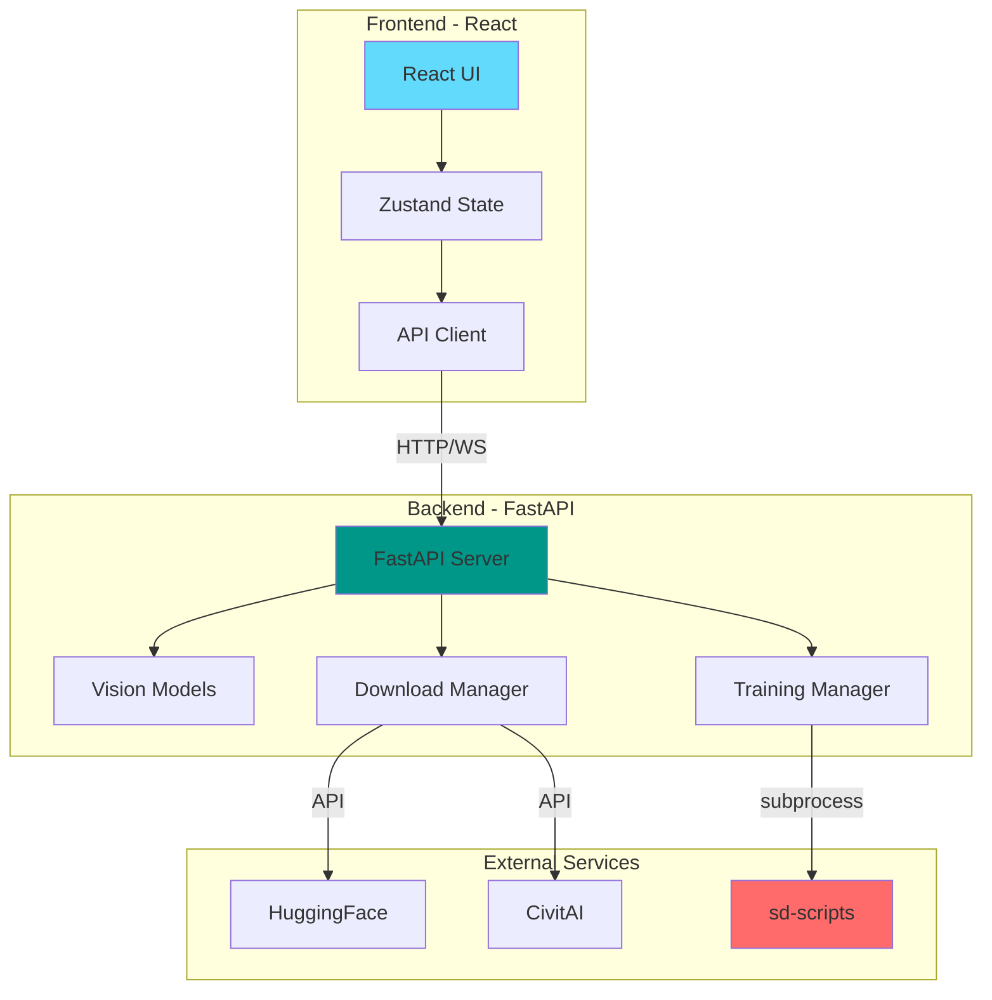

# 🎨 Kiko Trainer - Modern UI for FLUX LoRA Training

<div align="center">


A modern, React-based web application for training FLUX LoRA models with integrated captioning, dataset management, and HuggingFace publishing.

[Features](#-features) • [Quick Start](#-quick-start) • [Installation](#-installation) • [Usage](#-usage) • [API](#-api-reference) • [Contributing](#-contributing)

</div>

## 🌟 Features

### Core Capabilities

- **🖼️ Advanced Image Captioning** - Support for Florence-2 and Qwen2.5-VL models
- **📦 Automated Dataset Creation** - Smart image processing with latent caching
- **🚀 FLUX LoRA Training** - Full integration with kohya-ss/sd-scripts
- **📊 Real-time Monitoring** - Live training metrics and progress tracking
- **☁️ HuggingFace Publishing** - Direct upload to HuggingFace model hub
- **💾 Model Management** - Download from CivitAI and HuggingFace with preview support

### Modern UI Features

- **Responsive Design** - Works on desktop and mobile devices
- **Dark Mode** - Easy on the eyes during long training sessions
- **Real-time Updates** - WebSocket-based live training logs
- **Drag & Drop** - Intuitive file uploads
- **Progress Tracking** - Visual progress bars and metrics charts

## 🏗️ Architecture



## 🚀 Quick Start

### Using Docker (Recommended)

```bash
# Clone the repository
git clone git@github.com:ComfyAssets/kiko-trainer.git
cd kiko-trainer

# Start with Docker Compose
docker compose up -d --build

# Access the application
# Frontend: http://localhost:8080
# API: http://localhost:8001
```

### Manual Installation

```bash
# Clone and setup
git clone git@github.com:ComfyAssets/kiko-trainer.git
cd kiko-trainer

# Setup backend
./setup.sh  # This clones sd-scripts and installs dependencies

# Start backend
source venv/bin/activate
uvicorn backend.server:app --host 0.0.0.0 --port 8001 --reload

# In a new terminal - Setup frontend
cd web
npm install
npm run dev

# Access at http://localhost:5173
```

## 📋 Prerequisites

- Python 3.8+
- Node.js 16+
- CUDA-capable GPU (for training)
- 16GB+ VRAM recommended
- Git

## 🔧 Installation

### Backend Setup

1. **Clone the repository**

```bash
git clone git@github.com:ComfyAssets/kiko-trainer.git
cd kiko-trainer
```

2. **Run the setup script**

```bash
./setup.sh
```

This will:

- Clone kohya-ss/sd-scripts (required dependency)
- Create a Python virtual environment
- Install all Python dependencies

3. **GPU Setup (if needed)**

```bash
# For CUDA 12.1
pip install --pre torch torchvision torchaudio --index-url https://download.pytorch.org/whl/cu121
```

### Frontend Setup

```bash
cd web
npm install
```

### Frontend Environment

The web app reads configuration from Vite env vars. Copy `web/.env.example` to `web/.env` and adjust as needed:

- `VITE_API_HOST` / `VITE_API_PORT` — API location used by the web UI.
- `VITE_MODELS_DIR` — base directory for model components (UNet, CLIP, T5, VAE).
- `VITE_OUTPUTS_DIR` — base outputs directory for generated runs.

Defaults are `models` and `outputs`, matching the repo layout and Docker mounts (`/app/models`, `/app/outputs`).

In the Training page, “Model Paths (Advanced)” lets you override UNet/CLIP/T5/VAE paths. If provided, the backend will use these overrides for training; otherwise it resolves paths server-side from your configured models directory. These overrides are also reflected in the generated script and exports.

## 📖 Usage

### Training Workflow


### 1. Model Management

- Navigate to the **Models** tab
- Enter your CivitAI API key (get from [CivitAI Account](https://civitai.com/user/account))
- Download FLUX models and required components

### 2. Image Captioning

- Go to **Setup** tab
- Upload your images via drag & drop
- Choose captioning model:
  - **Florence-2**: Fast, good quality
  - **Qwen2.5-VL**: Slower, best quality
- Configure caption settings and generate

### 3. Dataset Creation

- Set output folder name
- Choose resolution (512, 768, 1024)
- Enable latent caching for faster training
- Create dataset

### 4. Training Configuration

- Navigate to **Training** tab
- Select base model and dataset
- Configure hyperparameters:
  - Learning rate: 1e-4 (recommended)
  - Steps: 500-2000
  - Batch size: Based on VRAM
- Start training

### 5. Publishing

- Go to **Publish** tab
- Select trained LoRA
- Enter HuggingFace credentials
- Configure repository settings
- Publish to HuggingFace

## 🎮 Advanced Features

### Vision Model Selection

The application supports multiple vision-language models:

| Model         | Size | Quality | Speed  | VRAM |
| ------------- | ---- | ------- | ------ | ---- |
| Florence-2    | 0.7B | Good    | Fast   | 4GB  |
| Qwen2.5-VL-3B | 3B   | Better  | Medium | 8GB  |
| Qwen2.5-VL-7B | 7B   | Best    | Slow   | 16GB |

### Training Parameters

```yaml
# Example configuration
learning_rate: 1e-4
network_dim: 32
network_alpha: 16
batch_size: 1
max_train_steps: 1000
save_every_n_steps: 100
```

### Metrics Monitoring

Real-time training metrics include:

- Loss curves
- Learning rate schedule
- Memory usage
- Training speed (it/s)
- Sample generation preview

## 🔌 API Reference

### Core Endpoints

| Endpoint              | Method | Description              |
| --------------------- | ------ | ------------------------ |
| `/api/health`         | GET    | Health check             |
| `/api/models`         | GET    | List available models    |
| `/api/caption`        | POST   | Caption images           |
| `/api/create_dataset` | POST   | Create training dataset  |
| `/api/train/prepare`  | POST   | Prepare training scripts |
| `/api/train/start`    | POST   | Start training           |
| `/api/train/logs`     | GET    | Get training logs        |
| `/api/loras`          | GET    | List trained LoRAs       |
| `/api/publish`        | POST   | Publish to HuggingFace   |

### WebSocket Endpoints

- `/api/train/ws` - Real-time training logs
- `/api/metrics/stream` - Live metrics updates

## 📁 Project Structure

```
kiko-trainer/
├── backend/                 # FastAPI backend
│   ├── server.py           # Main API server
│   ├── train_utils.py      # Training utilities
│   └── civitai_downloader.py # Model downloads
├── web/                    # React frontend
│   ├── src/
│   │   ├── components/     # React components
│   │   ├── pages/         # Application pages
│   │   └── store/         # State management
│   └── package.json
├── sd-scripts/            # Training engine (cloned)
├── models/                # Downloaded models
├── datasets/              # Training datasets
├── outputs/               # Trained LoRAs
├── docker-compose.yml     # Docker configuration
└── setup.sh              # Setup script
```

## 🐳 Docker Deployment

### Docker Compose Configuration

```yaml
version: "3.9"
services:
  api:
    build: .
    ports:
      - "8001:8001"
    volumes:
      - ./models:/app/models
      - ./outputs:/app/outputs
    environment:
      - HF_HUB_ENABLE_HF_TRANSFER=1

  web:
    build: ./web
    ports:
      - "8080:80"
    depends_on:
      - api
```

### Building Images

```bash
# Build and start
docker compose up -d --build

# View logs
docker compose logs -f

# Stop services
docker compose down
```

## 🛠️ Development

### Running Tests

```bash
# Backend tests
source venv/bin/activate
pytest

# Frontend tests
cd web
npm test
npm run type-check
```

### Code Style

- Backend: Black, Flake8, MyPy
- Frontend: ESLint, Prettier, TypeScript

## 🤝 Contributing

We welcome contributions! Please see our [Contributing Guide](CONTRIBUTING.md) for details.

1. Fork the repository
2. Create your feature branch (`git checkout -b feature/AmazingFeature`)
3. Commit your changes (`git commit -m 'Add some AmazingFeature'`)
4. Push to the branch (`git push origin feature/AmazingFeature`)
5. Open a Pull Request

## 📝 License

This project is licensed under the MIT License - see the [LICENSE](LICENSE) file for details.

## 🙏 Acknowledgments

- [kohya-ss/sd-scripts](https://github.com/kohya-ss/sd-scripts) - Training engine
- [FLUX](https://blackforestlabs.ai/) - Base model architecture
- [Florence-2](https://huggingface.co/microsoft/Florence-2-large) - Vision model
- [Qwen2.5-VL](https://huggingface.co/Qwen/Qwen2.5-VL-7B-Instruct) - Advanced vision model

## 🐛 Troubleshooting

### Common Issues

**CUDA not detected**

```bash
# Install CUDA-compatible PyTorch
pip install --pre torch torchvision torchaudio --index-url https://download.pytorch.org/whl/cu121
```

**Out of Memory**

- Reduce batch size to 1
- Enable gradient checkpointing
- Use 8-bit optimization
- Consider using a smaller vision model

**Port already in use**

```bash
# Change backend port
uvicorn backend.server:app --port 8002

# Change frontend port
cd web && VITE_PORT=3001 npm run dev
```

## 📞 Support

- **Issues**: [GitHub Issues](https://github.com/yourusername/kiko-trainer/issues)
- **Discussions**: [GitHub Discussions](https://github.com/yourusername/kiko-trainer/discussions)
- **Discord**: [Join our Discord](https://discord.gg/yourinvite)

## 🗺️ Roadmap

- [ ] Multi-GPU training support
- [ ] SDXL LoRA training
- [ ] Automatic dataset augmentation
- [ ] Training queue management
- [ ] Mobile app for monitoring
- [ ] Integration with ComfyUI/A1111

---

<div align="center">
Made with ❤️ by the Kiko Trainer Team
</div>
